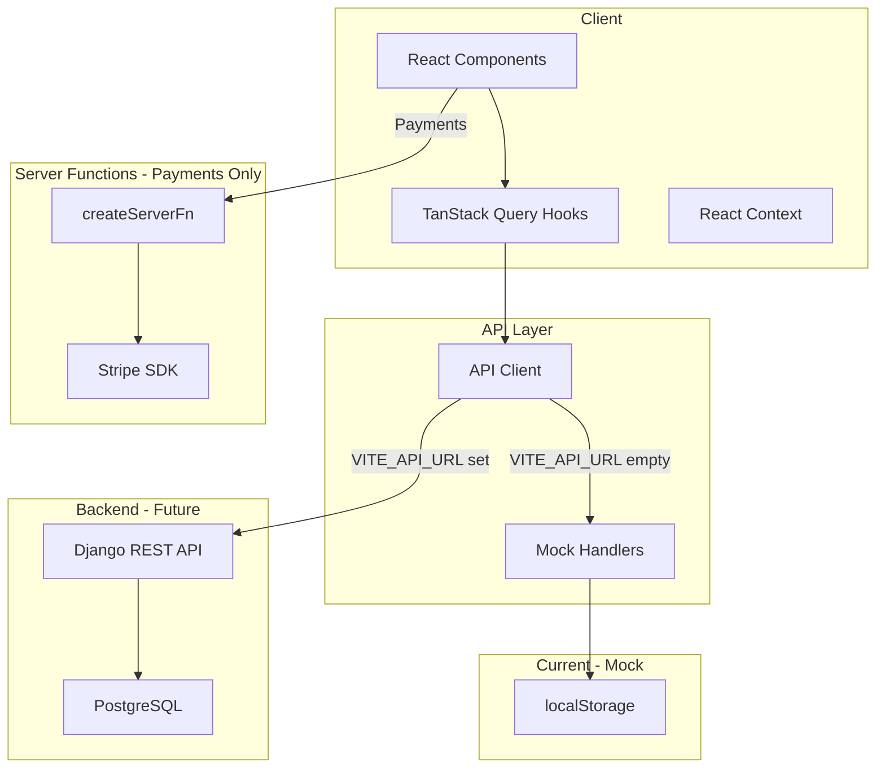
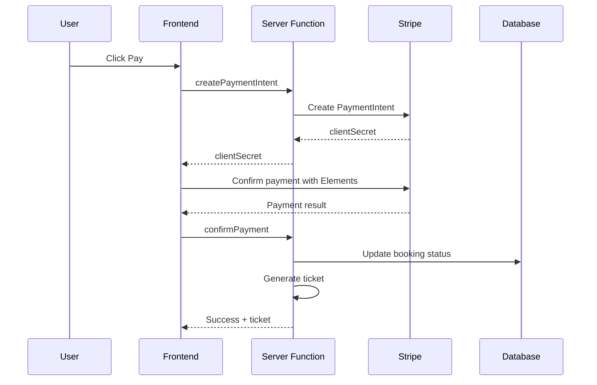
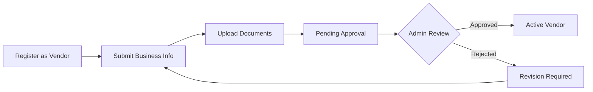

# Vizit Africa Frontend Development Plan

## Executive Summary

This plan outlines the remaining frontend development work for Vizit Africa, a tourism booking platform for Rwanda. The architecture will:

- Use **TanStack Start server functions** only for payment processing (Stripe) and sensitive operations
- Prepare for **Django backend API** integration (when ready)
- Use **mock data layer** that can be easily swapped for real API calls
- Deploy to **Cloudflare Workers**

---

## Current State Analysis

### What's Already Implemented ✅

| Feature               | Status      | Location                                                                   |
| --------------------- | ----------- | -------------------------------------------------------------------------- |
| Authentication (mock) | ✅ Complete | [`src/context/auth-context.tsx`](src/context/auth-context.tsx)             |
| Listings display      | ✅ Complete | [`src/routes/_app/listings/index.tsx`](src/routes/_app/listings/index.tsx) |
| Listing detail page   | ✅ Complete | [`src/routes/_app/listings/$id.tsx`](src/routes/_app/listings/$id.tsx)     |
| Cart functionality    | ✅ Complete | [`src/context/cart-context.tsx`](src/context/cart-context.tsx)             |
| Wishlist/Saved items  | ✅ Complete | [`src/context/wishlist-context.tsx`](src/context/wishlist-context.tsx)     |
| Basic checkout flow   | ✅ Partial  | [`src/routes/_app/cart/checkout.tsx`](src/routes/_app/cart/checkout.tsx)   |
| Dashboard layout      | ✅ Partial  | [`src/routes/_app/dashboard/`](src/routes/_app/dashboard/)                 |
| Search & filters      | ✅ Complete | [`src/routes/_app/listings/index.tsx`](src/routes/_app/listings/index.tsx) |
| Pagination            | ✅ Complete | [`src/routes/_app/listings/index.tsx`](src/routes/_app/listings/index.tsx) |
| Mock database         | ✅ Complete | [`src/utils/mock-db.ts`](src/utils/mock-db.ts)                             |

### What Needs Work 🔧

| Feature                              | Priority | Complexity |
| ------------------------------------ | -------- | ---------- |
| Server functions architecture        | High     | Medium     |
| Stripe payment integration           | High     | High       |
| Digital ticket generation (PDF + QR) | High     | Medium     |
| Vendor onboarding flow               | High     | Medium     |
| Admin approval workflows             | High     | Medium     |
| User profile management              | Medium   | Low        |
| Vendor booking management            | Medium   | Medium     |
| Email notifications (structure)      | Medium   | Low        |
| Internationalization (i18n)          | Low      | Medium     |
| SEO optimization                     | Low      | Low        |

---

## Architecture Overview

### Backend Strategy

The frontend will be designed to work with:

1. **Mock data layer** (current) - localStorage-based for development
2. **Django REST API** (future) - Your company's backend when ready

**Server functions** will only be used for:

- Stripe payment processing (requires server-side secret key)
- Any auth token refresh if needed
- PDF ticket generation (optional, can also be client-side)

### Proposed Directory Structure

```
src/
├── api/                        # NEW: API client layer
│   ├── client.ts               # Axios/fetch client with interceptors
│   ├── endpoints.ts            # API endpoint definitions
│   └── mock/                   # Mock implementations
│       ├── listings.mock.ts
│       ├── bookings.mock.ts
│       └── users.mock.ts
├── server-functions/           # TanStack Start server functions (minimal)
│   └── payments.ts             # Stripe payment handling ONLY
├── services/                   # External service integrations
│   ├── stripe.ts               # Stripe SDK wrapper
│   └── pdf-generator.ts        # PDF ticket generation
├── schemas/                    # Zod validation schemas
│   ├── booking.schema.ts
│   ├── listing.schema.ts
│   ├── payment.schema.ts
│   └── user.schema.ts
├── types/                      # Shared TypeScript types
│   ├── api.types.ts
│   ├── booking.types.ts
│   └── payment.types.ts
├── context/                    # React contexts (keep existing)
├── components/                 # UI components (keep existing)
├── hooks/                      # Custom hooks (refactor to use api layer)
├── routes/                     # TanStack Router routes (keep existing)
├── actions/                    # KEEP but refactor to use api layer
└── utils/                      # Utilities (keep existing)
```

### Data Flow Architecture



---

## Implementation Phases

### Phase 1: API Client Layer & Mock Data Refactor

Create a clean API abstraction layer that can switch between mock data (now) and Django backend (later).

#### 1.1 Create API Client

```typescript
// src/api/client.ts
import { env } from "@/env";

const API_BASE_URL = env.VITE_API_URL || "";

// When Django backend is ready, this will make real API calls
// For now, it will use mock implementations
export const apiClient = {
  get: async <T>(
    endpoint: string,
    params?: Record<string, any>,
  ): Promise<T> => {
    // Check if we should use mock
    if (!API_BASE_URL) {
      return mockHandlers.get(endpoint, params);
    }

    const response = await fetch(`${API_BASE_URL}${endpoint}`, {
      headers: { "Content-Type": "application/json" },
    });
    return response.json();
  },

  post: async <T>(endpoint: string, data: any): Promise<T> => {
    if (!API_BASE_URL) {
      return mockHandlers.post(endpoint, data);
    }

    const response = await fetch(`${API_BASE_URL}${endpoint}`, {
      method: "POST",
      headers: { "Content-Type": "application/json" },
      body: JSON.stringify(data),
    });
    return response.json();
  },
  // ... put, delete, etc.
};
```

#### 1.2 API Endpoints Definition

```typescript
// src/api/endpoints.ts
export const API_ENDPOINTS = {
  // Listings
  LISTINGS: "/api/listings",
  LISTING_BY_ID: (id: number) => `/api/listings/${id}`,

  // Bookings
  BOOKINGS: "/api/bookings",
  MY_BOOKINGS: "/api/bookings/me",

  // Users & Auth
  LOGIN: "/api/auth/login",
  REGISTER: "/api/auth/register",
  PROFILE: "/api/users/me",

  // Vendors
  VENDORS: "/api/vendors",
  VENDOR_LISTINGS: "/api/vendors/me/listings",

  // Admin
  PENDING_VENDORS: "/api/admin/vendors/pending",
  APPROVE_VENDOR: (id: number) => `/api/admin/vendors/${id}/approve`,
} as const;
```

#### 1.3 Refactor Hooks to Use API Client

```typescript
// src/hooks/use-listings.ts (refactored)
import { useQuery } from "@tanstack/react-query";
import { apiClient } from "@/api/client";
import { API_ENDPOINTS } from "@/api/endpoints";

export const useListings = (filters?: ListingFilters) => {
  return useQuery({
    queryKey: ["listings", filters],
    queryFn: () => apiClient.get<Listing[]>(API_ENDPOINTS.LISTINGS, filters),
  });
};
```

#### 1.4 Server Functions (Minimal - Payments Only)

Server functions will ONLY be used for Stripe payments (requires secret key on server):

| Function              | Purpose                      | Input                            | Output                |
| --------------------- | ---------------------------- | -------------------------------- | --------------------- |
| `createPaymentIntent` | Stripe payment intent        | `{ amount, currency, metadata }` | `{ clientSecret }`    |
| `confirmPayment`      | Confirm and finalize booking | `{ paymentIntentId, bookingId }` | `{ success, ticket }` |

### Phase 2: Stripe Payment Integration

#### 2.1 Payment Flow



#### 2.2 Stripe Integration Components

```typescript
// src/services/stripe.ts
import Stripe from "stripe";

export const createStripeClient = (secretKey: string) => {
  return new Stripe(secretKey, {
    apiVersion: "2024-12-18.acacia",
  });
};

// src/server-functions/payments.ts
import { createServerFn } from "@tanstack/react-start/server";
import { z } from "zod";

const createPaymentIntentSchema = z.object({
  amount: z.number().positive(),
  currency: z.string().default("usd"),
  bookingId: z.number(),
  metadata: z.record(z.string()).optional(),
});

export const createPaymentIntent = createServerFn()
  .validator(createPaymentIntentSchema)
  .handler(async ({ data, request }) => {
    const env = request.context.cloudflare.env;
    const stripe = createStripeClient(env.STRIPE_SECRET_KEY);

    const paymentIntent = await stripe.paymentIntents.create({
      amount: data.amount * 100, // Convert to cents
      currency: data.currency,
      metadata: {
        bookingId: data.bookingId.toString(),
        ...data.metadata,
      },
    });

    return { clientSecret: paymentIntent.client_secret };
  });
```

#### 2.3 Checkout Page Updates

- Replace mock payment form with Stripe Elements
- Add `@stripe/stripe-js` and `@stripe/react-stripe-js` packages
- Implement proper error handling and loading states
- Add payment method selection (card, etc.)

### Phase 3: Digital Ticket Generation

#### 3.1 Ticket Components

```typescript
// src/services/pdf-generator.ts
// Using @react-pdf/renderer for PDF generation

export interface TicketData {
  bookingId: number;
  customerName: string;
  listingTitle: string;
  checkIn: Date;
  checkOut: Date;
  guests: number;
  totalAmount: number;
  qrCodeData: string;
}

export const generateTicketPDF = async (data: TicketData): Promise<Blob> => {
  // Generate PDF with booking details and QR code
};
```

#### 3.2 QR Code Validation

- QR code contains: `VIZIT-{bookingId}-{hash}`
- Hash is HMAC-SHA256 of booking details for verification
- Vendors can scan to validate tickets

### Phase 4: Vendor Features

#### 4.1 Vendor Onboarding Flow



#### 4.2 Vendor Dashboard Features

| Feature      | Route                        | Description                   |
| ------------ | ---------------------------- | ----------------------------- |
| Overview     | `/dashboard`                 | Revenue, bookings stats       |
| My Listings  | `/dashboard/listings`        | CRUD for listings             |
| Bookings     | `/dashboard/vendor-bookings` | Manage incoming bookings      |
| Availability | `/dashboard/availability`    | Calendar-based availability   |
| Settings     | `/dashboard/settings`        | Business profile, payout info |

#### 4.3 Vendor Booking Management

- View incoming booking requests
- Approve/reject bookings
- Contact customers
- Mark bookings as completed

### Phase 5: Admin Features

#### 5.1 Admin Dashboard

| Feature          | Route                  | Description              |
| ---------------- | ---------------------- | ------------------------ |
| Overview         | `/dashboard`           | Platform stats           |
| Vendor Approvals | `/dashboard/approvals` | Approve/reject vendors   |
| User Management  | `/dashboard/users`     | View/manage users        |
| All Bookings     | `/dashboard/bookings`  | Platform-wide bookings   |
| Listings Review  | `/dashboard/listings`  | Review/moderate listings |

#### 5.2 Approval Workflow

```typescript
// src/api/admin.ts - Will call Django backend when ready
export const approveVendor = async (data: {
  vendorId: number;
  approved: boolean;
  notes?: string;
}) => {
  return apiClient.post(API_ENDPOINTS.APPROVE_VENDOR(data.vendorId), {
    approved: data.approved,
    notes: data.notes,
  });
};
```

### Phase 6: User Profile & Settings

#### 6.1 Profile Features

- View/edit personal information
- Change password
- Manage notification preferences
- View booking history
- Download past tickets

#### 6.2 Routes to Add

| Route                    | Purpose                  |
| ------------------------ | ------------------------ |
| `/profile`               | User profile page        |
| `/profile/settings`      | Account settings         |
| `/profile/bookings`      | Booking history          |
| `/profile/notifications` | Notification preferences |

### Phase 7: Notifications Structure

#### 7.1 Email Templates (Structure Only)

Prepare email template interfaces for when email service is connected:

```typescript
// src/services/email.ts
export interface EmailTemplate {
  to: string;
  subject: string;
  template: "booking-confirmation" | "vendor-approval" | "payment-receipt";
  data: Record<string, unknown>;
}

export const sendEmail = async (template: EmailTemplate) => {
  // Will integrate with email provider later
  console.log("Email would be sent:", template);
};
```

#### 7.2 Notification Types

- Booking confirmation (tourist)
- New booking received (vendor)
- Vendor approval status
- Payment receipt
- Booking reminder

### Phase 8: SEO & Internationalization

#### 8.1 SEO Improvements

- Add meta tags to all pages
- Implement JSON-LD structured data
- Add sitemap generation
- Optimize images with lazy loading

#### 8.2 i18n Implementation

**Supported Locales:**

- `en` - English (default)
- `fr` - French
- `rw` - Kinyarwanda

**Approach: TanStack Router i18n with react-i18next**

```typescript
// src/i18n/config.ts
import i18n from "i18next";
import { initReactI18next } from "react-i18next";
import LanguageDetector from "i18next-browser-languagedetector";

i18n
  .use(LanguageDetector)
  .use(initReactI18next)
  .init({
    fallbackLng: "en",
    supportedLngs: ["en", "fr", "rw"],
    defaultNS: "common",
    interpolation: {
      escapeValue: false,
    },
    detection: {
      order: ["path", "localStorage", "navigator"],
      lookupFromPathIndex: 0,
    },
  });

export default i18n;
```

**Translation File Structure:**

```
src/i18n/
├── config.ts
└── locales/
    ├── en/
    │   ├── common.json      # Common UI strings
    │   ├── listings.json    # Listing-related strings
    │   ├── booking.json     # Booking flow strings
    │   ├── dashboard.json   # Dashboard strings
    │   └── auth.json        # Auth-related strings
    ├── fr/
    │   ├── common.json
    │   ├── listings.json
    │   ├── booking.json
    │   ├── dashboard.json
    │   └── auth.json
    └── rw/
        ├── common.json
        ├── listings.json
        ├── booking.json
        ├── dashboard.json
        └── auth.json
```

**Route-based Locale (TanStack Router):**

```typescript
// src/routes/__root.tsx
import { createRootRoute, Outlet } from '@tanstack/react-router'

export const Route = createRootRoute({
  validateSearch: (search) => ({
    lang: (search.lang as string) || 'en'
  }),
  beforeLoad: ({ search }) => {
    // Set i18n language based on URL or search param
    i18n.changeLanguage(search.lang)
  },
  component: () => <Outlet />
})
```

**Usage in Components:**

```typescript
import { useTranslation } from 'react-i18next'

function ListingCard({ listing }) {
  const { t } = useTranslation('listings')

  return (
    <Card>
      <CardTitle>{listing.title}</CardTitle>
      <p>{t('perNight', { price: listing.base_price })}</p>
      <Button>{t('bookNow')}</Button>
    </Card>
  )
}
```

**Example Translation Files:**

```json
// src/i18n/locales/en/common.json
{
  "nav": {
    "home": "Home",
    "listings": "Explore",
    "about": "About",
    "contact": "Contact",
    "login": "Login",
    "signup": "Sign Up"
  },
  "footer": {
    "copyright": "© 2026 Vizit Africa. All rights reserved.",
    "terms": "Terms of Service",
    "privacy": "Privacy Policy"
  }
}

// src/i18n/locales/fr/common.json
{
  "nav": {
    "home": "Accueil",
    "listings": "Explorer",
    "about": "À propos",
    "contact": "Contact",
    "login": "Connexion",
    "signup": "Inscription"
  },
  "footer": {
    "copyright": "© 2026 Vizit Africa. Tous droits réservés.",
    "terms": "Conditions d'utilisation",
    "privacy": "Politique de confidentialité"
  }
}

// src/i18n/locales/rw/common.json
{
  "nav": {
    "home": "Ahabanza",
    "listings": "Shakisha",
    "about": "Ibyerekeye",
    "contact": "Twandikire",
    "login": "Injira",
    "signup": "Iyandikishe"
  },
  "footer": {
    "copyright": "© 2026 Vizit Africa. Uburenganzira bwose burarinzwe.",
    "terms": "Amategeko y'ikoreshwa",
    "privacy": "Politiki y'ibanga"
  }
}
```

**Language Switcher Component:**

```typescript
// src/components/language-switcher.tsx
import { useTranslation } from 'react-i18next'
import { Button } from '@/components/ui/button'
import {
  DropdownMenu,
  DropdownMenuContent,
  DropdownMenuItem,
  DropdownMenuTrigger
} from '@/components/ui/dropdown-menu'
import { Globe } from 'lucide-react'

const languages = [
  { code: 'en', name: 'English', flag: '🇬🇧' },
  { code: 'fr', name: 'Français', flag: '🇫🇷' },
  { code: 'rw', name: 'Kinyarwanda', flag: '🇷🇼' }
]

export function LanguageSwitcher() {
  const { i18n } = useTranslation()

  return (
    <DropdownMenu>
      <DropdownMenuTrigger asChild>
        <Button variant="ghost" size="icon">
          <Globe className="h-4 w-4" />
        </Button>
      </DropdownMenuTrigger>
      <DropdownMenuContent align="end">
        {languages.map((lang) => (
          <DropdownMenuItem
            key={lang.code}
            onClick={() => i18n.changeLanguage(lang.code)}
            className={i18n.language === lang.code ? 'bg-accent' : ''}
          >
            <span className="mr-2">{lang.flag}</span>
            {lang.name}
          </DropdownMenuItem>
        ))}
      </DropdownMenuContent>
    </DropdownMenu>
  )
}
```

**New Dependencies for i18n:**

```json
{
  "dependencies": {
    "i18next": "^24.0.0",
    "react-i18next": "^15.0.0",
    "i18next-browser-languagedetector": "^8.0.0"
  }
}
```

---

## Technical Specifications

### Environment Variables

```bash
# .env
VITE_STRIPE_PUBLISHABLE_KEY=pk_test_...
VITE_API_URL=                          # Empty for mock, set to Django URL when ready
STRIPE_SECRET_KEY=sk_test_...
STRIPE_WEBHOOK_SECRET=whsec_...

# Cloudflare Workers secrets (set via wrangler)
# wrangler secret put STRIPE_SECRET_KEY
```

### New Dependencies

```json
{
  "dependencies": {
    "@stripe/stripe-js": "^4.0.0",
    "@stripe/react-stripe-js": "^3.0.0",
    "@react-pdf/renderer": "^4.0.0"
  },
  "devDependencies": {
    "stripe": "^17.0.0"
  }
}
```

### Cloudflare Workers Configuration

```toml
# wrangler.toml
name = "vizit-africa"
compatibility_date = "2026-01-28"
compatibility_flags = ["nodejs_compat"]
main = "@tanstack/react-start/server-entry"

[vars]
VITE_STRIPE_PUBLISHABLE_KEY = "pk_test_..."
VITE_API_URL = ""  # Set to Django backend URL when ready
```

---

## Implementation Checklist

### Phase 1: API Client Layer & Mock Data Refactor

- [ ] Create `src/api/` directory structure
- [ ] Implement `src/api/client.ts` with mock fallback
- [ ] Create `src/api/endpoints.ts` with all endpoint definitions
- [ ] Create `src/api/mock/` directory with mock handlers
- [ ] Migrate `listing.actions.ts` to use API client
- [ ] Migrate `booking.actions.ts` to use API client
- [ ] Migrate `auth.actions.ts` to use API client
- [ ] Migrate `location.actions.ts` to use API client
- [ ] Create Zod validation schemas for API responses
- [ ] Update all hooks to use new API client
- [ ] Add proper error handling and loading states

### Phase 2: Stripe Payment Integration (Server Functions)

- [ ] Install Stripe packages
- [ ] Create `src/server-functions/payments.ts`
- [ ] Implement `createPaymentIntent` server function
- [ ] Implement `confirmPayment` server function
- [ ] Create Stripe service wrapper
- [ ] Update checkout page with Stripe Elements
- [ ] Add payment success/failure handling
- [ ] Implement webhook handler for payment events
- [ ] Add payment method display in booking details

### Phase 3: Digital Ticket Generation

- [ ] Install PDF generation library
- [ ] Create ticket PDF template component
- [ ] Implement QR code generation with validation hash
- [ ] Add ticket generation to booking confirmation flow
- [ ] Add ticket download button to booking details
- [ ] Create ticket preview modal
- [ ] Add ticket to email confirmation (structure)

### Phase 4: Vendor Features

- [ ] Create vendor registration form
- [ ] Implement vendor onboarding flow
- [ ] Build vendor dashboard overview
- [ ] Implement listing CRUD for vendors
- [ ] Create availability calendar component
- [ ] Build vendor booking management page
- [ ] Add vendor payout settings (structure)

### Phase 5: Admin Features

- [ ] Build admin dashboard overview with stats
- [ ] Implement vendor approval workflow
- [ ] Create user management table
- [ ] Build listings moderation interface
- [ ] Add platform-wide booking view
- [ ] Implement admin action logging

### Phase 6: User Profile

- [ ] Create profile page layout
- [ ] Implement profile edit form
- [ ] Add password change functionality
- [ ] Build booking history view
- [ ] Add notification preferences
- [ ] Implement ticket download from history

### Phase 7: Notifications

- [ ] Define email template interfaces
- [ ] Create notification service structure
- [ ] Add in-app notification component
- [ ] Implement notification preferences storage

### Phase 8: SEO & i18n

**SEO:**

- [ ] Add meta tags to all routes
- [ ] Implement JSON-LD for listings
- [ ] Create sitemap generation
- [ ] Optimize image loading
- [ ] Add loading skeletons
- [ ] Improve error boundaries
- [ ] Add 404 and error pages

**Internationalization (i18n):**

- [ ] Install i18next, react-i18next, i18next-browser-languagedetector
- [ ] Create `src/i18n/config.ts` with language detection
- [ ] Create translation file structure (`src/i18n/locales/`)
- [ ] Create English translations (`en/common.json`, `en/listings.json`, etc.)
- [ ] Create French translations (`fr/common.json`, `fr/listings.json`, etc.)
- [ ] Create Kinyarwanda translations (`rw/common.json`, `rw/listings.json`, etc.)
- [ ] Create `LanguageSwitcher` component
- [ ] Add language switcher to header
- [ ] Update all hardcoded strings to use `useTranslation` hook
- [ ] Implement language persistence in localStorage
- [ ] Add language to URL params (optional)

---

## Risk Mitigation

| Risk                          | Mitigation                                               |
| ----------------------------- | -------------------------------------------------------- |
| Stripe integration complexity | Use Stripe's prebuilt Elements, follow official docs     |
| PDF generation on Workers     | Use lightweight library, consider client-side generation |
| Mock to Django API migration  | Abstract API layer with switchable client                |
| Payment security              | Never handle card data directly, use Stripe Elements     |
| Large file uploads            | Implement client-side validation, consider R2 for media  |
| i18n translation quality      | Start with English, get native speakers for FR/RW        |

---

## Success Metrics

- [ ] API client works with mock data and can switch to Django
- [ ] Stripe test payments complete successfully
- [ ] PDF tickets generate with valid QR codes
- [ ] Vendor can complete full onboarding flow
- [ ] Admin can approve/reject vendors
- [ ] User can view and download past tickets
- [ ] All pages have proper meta tags
- [ ] Language switcher works for EN/FR/RW
- [ ] All UI strings are translatable
- [ ] No TypeScript errors
- [ ] All existing tests pass

---

## Next Steps

1. **Review this plan** and provide feedback
2. **Switch to Code mode** to begin implementation
3. **Start with Phase 1** - API Client Layer & Mock Data Refactor
4. **Iterate** through remaining phases

Ready to proceed?
